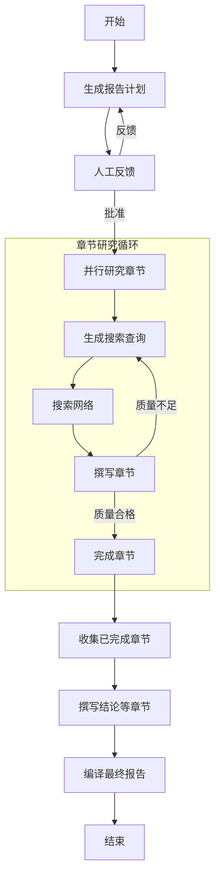
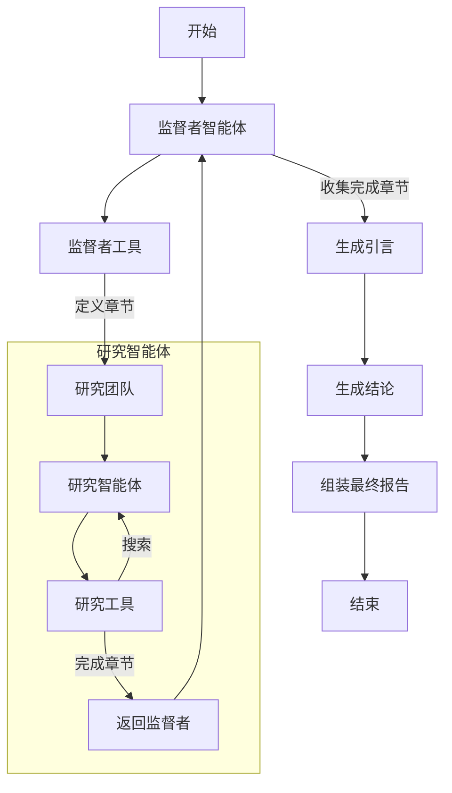
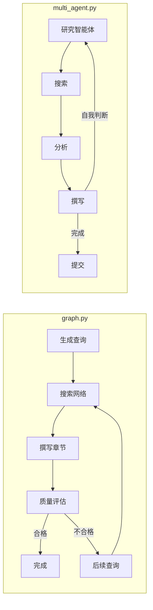
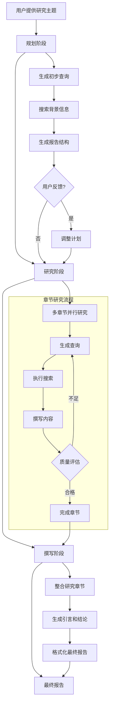
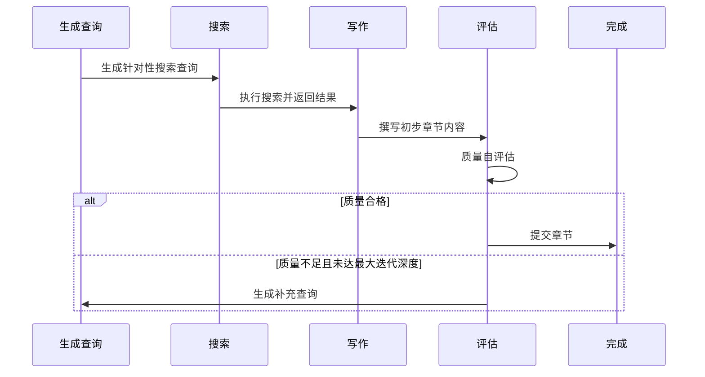
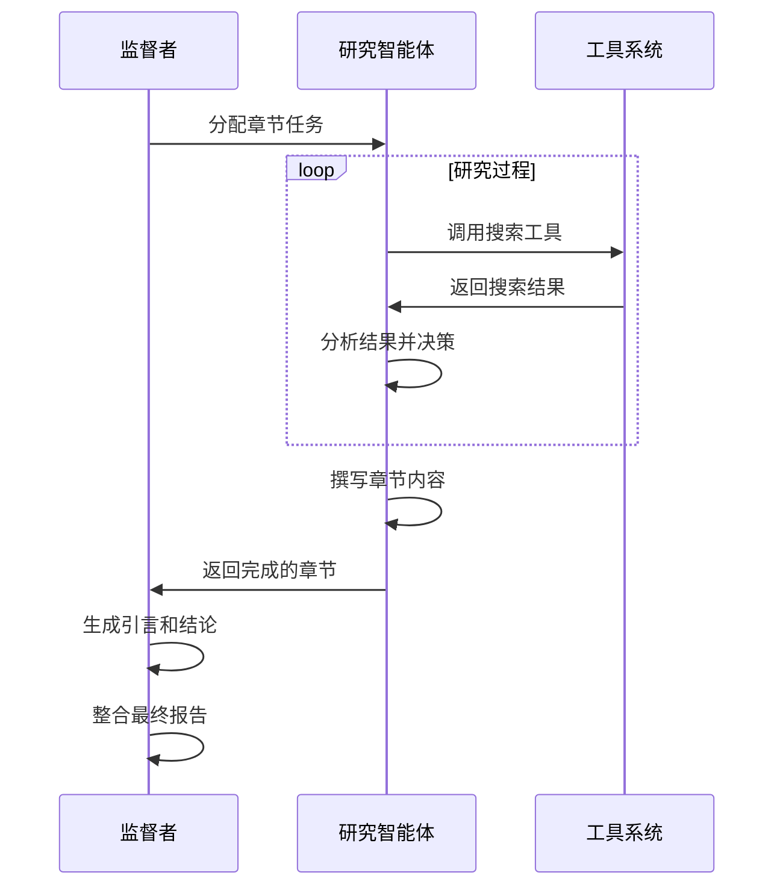

# Open Deep Research 项目分析

## 项目结构和框架

* **编程语言和框架**：使用Python作为主要编程语言，基于LangGraph和LangChain构建的工作流系统。LangGraph提供了强大的图形化工作流管理能力，而LangChain则提供了与大语言模型交互的标准接口。
* **代码目录结构**：
  * `src/open_deep_research/`: 核心代码目录
    * `graph.py`: 实现基于LangGraph的结构化工作流架构，通过明确定义的节点和边控制研究流程
    * `multi_agent.py`: 实现多智能体协作系统，通过监督者和研究团队的分工合作完成研究任务
    * `prompts.py`: 定义系统使用的提示模板，指导大语言模型生成高质量的研究内容
    * `utils.py`: 工具函数和辅助类，提供搜索API集成和数据处理功能
    * `configuration.py`: 配置管理，控制模型选择、搜索参数和工作流行为
    * `state.py`: 状态管理类，定义系统在执行过程中的状态数据结构
  * `examples/`: 示例代码和使用案例，展示系统的不同用例和配置方式
  * `tests/`: 测试代码，确保系统功能的正确性和稳定性

## 实现方式对比

### 结构化工作流与多智能体架构比较

| 特性 | graph.py (结构化工作流) | multi_agent.py (多智能体系统) |
|------|------------------------|----------------------------|
| **控制流程** | 预定义节点和边，静态结构 | 智能体决策驱动，动态结构 |
| **用户参与** | 提供明确的人工反馈环节 | 主要依赖自动化过程 |
| **章节迭代** | 显式迭代控制，基于质量评估 | 智能体自主决定研究深度 |
| **质量控制** | 独立的评估阶段和明确的质量标准 | 依赖研究智能体自我判断 |
| **模块化** | 高度结构化，每个节点功能明确 | 基于能力分工，职责划分 |
| **并行处理** | 使用Send命令实现并行 | 天然的智能体并行架构 |
| **可预测性** | 流程更加可预测和可控 | 更加灵活但结果可能更多变 |
| **错误恢复** | 基于节点的精确恢复 | 基于智能体状态的恢复 |

### 结构化工作流 (graph.py) 架构

### 多智能体系统 (multi_agent.py) 架构

### 核心区别细节

* **graph.py（结构化工作流实现）**：
  * 提供了一个高度结构化的研究流程，每个步骤都有明确定义的功能和转换条件
  * 实现了人工反馈机制，允许用户审核和调整报告计划
  * 采用迭代深度控制机制，通过质量评估决定是否需要额外的研究迭代
  * 明确区分需要研究的章节和基于已有研究的章节（如摘要、结论）
  * 使用条件边缘和命令返回机制实现动态工作流程
  * 章节质量评估由专门的评估组件处理，具有明确的质量标准
  * 研究深度由`max_search_depth`参数精确控制，每个章节可能有多轮迭代
  * 状态转换更加明确，便于调试和监控

* **multi_agent.py（多智能体实现）**：
  * 采用监督者-执行者架构，监督者负责规划和整合，研究团队负责具体研究
  * 通过工具调用实现智能体间通信，使用Sections工具进行任务分解
  * 研究过程更加自主化，依赖智能体的自主判断决定研究深度
  * 实现了并行任务处理能力，各章节可以同时研究
  * 监督者专门负责生成引言和结论，整合研究团队的成果
  * 工具调用作为智能体决策的主要机制，而非预定义路径
  * 每个智能体有自己的系统指令和专门职责
  * 整体流程更加灵活，但可能更难预测和控制
  * 智能体间通过消息和工具结果进行通信和协作

### 章节研究循环比较

## 交互方式

* **Python库**：可作为Python库导入使用，提供灵活的API接口，允许开发者集成到自己的应用中并自定义工作流程。
* **Jupyter Notebook**：提供交互式笔记本示例，方便研究人员和数据科学家探索系统功能并根据特定需求定制研究流程。
* **LangGraph Studio UI**：通过LangGraph Studio提供图形化界面，可视化工作流执行过程，便于监控和调试复杂的研究流程。
* **命令行工具**：支持命令行操作，适合自动化脚本和批处理任务，便于集成到现有工作流程中。

## 基本流程

1. **话题输入**：用户提供研究主题，系统将其作为整个研究过程的核心焦点。
2. **规划阶段**：
   * 系统首先生成初步搜索查询以收集规划所需的背景信息
   * 基于搜索结果，生成结构化的研究计划和章节划分
   * 在graph.py实现中，用户可以审核计划并提供反馈，系统将根据反馈调整计划
   * 在multi_agent.py实现中，监督者智能体自主确定报告结构
3. **研究阶段**：
   * 为每个报告章节生成针对性的搜索查询，确保信息的相关性
   * 执行搜索并收集信息，整合为研究素材
   * 在graph.py中，系统会评估每个章节的信息质量，并根据需要生成后续查询进行迭代深化
   * 可以进行多轮搜索-评估-写作循环，直到内容达到质量要求或达到最大迭代深度
4. **撰写阶段**：
   * 根据收集的信息撰写各个章节内容
   * 对不需要直接研究的章节（如摘要、结论），使用已完成的研究章节作为上下文
   * 整合所有章节内容，生成格式规范的完整研究报告

## 上下文管理

* **状态管理**：使用LangGraph的状态管理系统跟踪研究进度，维护各章节的研究状态和内容，确保长时间运行的研究过程可以稳定执行。
* **工作流控制**：通过图结构定义工作流程，明确各节点之间的转换条件，实现复杂的条件逻辑和循环结构。
* **用户反馈整合**：在规划阶段接收并整合用户反馈，允许人机协作优化研究计划，确保研究方向符合用户期望。
* **分段处理**：将大型研究任务分解为小块，分段处理和管理，有效应对复杂主题和大规模信息收集需求。

## 迭代研究机制

### graph.py中的迭代研究流程

### multi_agent.py中的研究流程

* **质量评估循环**：在graph.py实现中，每个章节完成初稿后会进行自我评估，决定是否需要额外研究。
* **深度控制参数**：通过`max_search_depth`参数限定最大迭代次数，平衡研究深度和资源消耗。
* **反馈生成**：评估模型会生成具体的后续查询，针对当前内容的不足之处进行定向研究。
* **动态流程控制**：使用Command对象和goto参数实现动态流程跳转，形成灵活的研究循环路径。
* **状态累积**：每次迭代保留并更新先前的研究成果，确保知识持续积累而非重复劳动。

## 工具使用

* **多搜索引擎集成**：支持多种搜索API，包括Tavily、Perplexity、Exa、ArXiv、PubMed等，使用户可以根据研究主题选择最合适的信息源，学术研究可使用专业搜索引擎。
* **自定义模型支持**：支持任何兼容LangChain `init_chat_model()` API的模型，用户可以根据自己的需求和资源选择合适的语言模型，从开源模型到商业API均可接入。
* **检查点系统**：使用LangGraph的检查点系统保存研究进度，允许长时间研究任务的中断和恢复，避免因技术故障导致工作丢失。
* **结构化输出处理**：支持模型生成结构化输出，将非结构化的LLM响应转换为可编程处理的数据结构，便于系统进行后续加工和整合。

## 执行效果

* **全面的研究报告**：生成结构化、深入的研究报告，包含多个相互关联的章节，覆盖主题的各个关键方面。
* **可追踪的研究过程**：记录搜索查询和信息来源，提高研究透明度，允许用户验证和追踪信息的准确性和可靠性。
* **交互式规划**：允许用户参与研究计划的调整，确保最终报告符合用户的具体需求和关注点。
* **学术研究支持**：通过ArXiv和PubMed等专业学术搜索API，支持科学和医学领域的深度研究，满足学术用户的严谨要求。

## 成本控制

* **搜索深度控制**：通过 `max_search_depth` 参数限制每个章节的搜索迭代次数，防止过度搜索导致的API费用激增。
* **查询数量优化**：可配置每个章节的搜索查询数量，通过 `number_of_queries` 参数精确控制搜索API的调用次数。
* **模型选择灵活性**：支持选择不同性能和成本的模型，用户可以根据预算选择合适的模型配置，从轻量级开源模型到高端商业API均可使用。
* **资源高效使用**：合理分配任务给计划者和撰写者模型，对需要深度思考的规划和评估任务使用高级模型，对常规撰写任务使用经济型模型。

## 其他特性

* **双模式实现**：提供结构化工作流（graph.py）和多智能体系统（multi_agent.py）两种实现方式，用户可以根据需要选择更适合自己使用场景的模式。
* **高度可定制**：支持自定义报告结构、模型参数和搜索工具，通过配置文件或API参数实现系统行为的精细控制。
* **特定领域支持**：通过专门的搜索API（如ArXiv、PubMed）支持专业领域研究，让系统能够访问高质量的专业知识库和学术资源。
* **Markdown格式输出**：生成格式化的Markdown报告，支持标题层级、列表、引用等富文本元素，便于阅读、分享和进一步编辑。
* **开源可扩展**：完全开源实现，代码结构清晰模块化，便于社区贡献和扩展，用户可以添加新的搜索API或自定义处理节点。